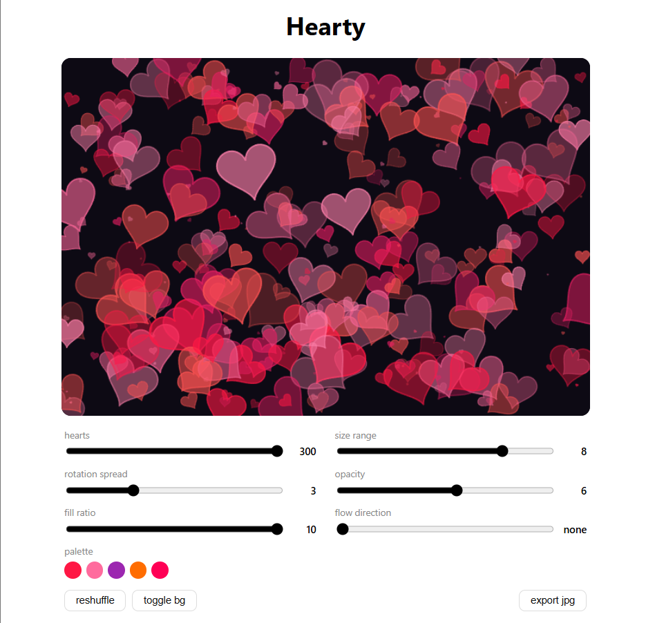

> Note: this project uses AI for improvement suggestions for Sliders design and SVG Paths and also quick fixes (like spot a typo.)

---



# Hearty

A generative art tool that scatters parametric hearts and stars across a canvas, inspired by the mathematical artwork of [Hamid Naderi Yeganeh](https://en.wikipedia.org/wiki/Hamid_Naderi_Yeganeh).

---

## How it works

Each heart is rendered from a classic parametric curve:

```
x(t) = 16 sin^3(t)
y(t) = 13cos(t) - 5cos(2t) - 2cos(3t) - cos(4t)
```

The curve is expressed as a finite trigonometric series. Each cosine harmonic refines the shape: the first term `13cos(t)` gives a basic oval, and each subsequent term pulls the top into a dip and the bottom into a point.

A different but well known algebraic heart shape is:

```
(x^2 + y^2 - 1)^3 - x^2y^3 <= 0
```

Unlike the parametric curve used by Hearty, this equation defines a filled heart region directly in Cartesian coordinates. The two curves are not equivalent, they just both happen to be heart-shaped.

Hearty uses the parametric form because it directly generates a polygonal boundary that Canvas can render efficiently.

Each star uses polar alternation between outer radius `R = 16` and inner radius `r = 6.5`:

```
r(θ) = R if i even (spike tip)
r(θ) = r if i odd (inner valley)


x(θ) = r(θ) · cos(θ)
y(θ) = r(θ) · sin(θ)
```

where `θᵢ = (i / 2n) · 2π - π/2` for a star with `n` spikes.

Both shapes are transformed per-instance via a 2D rotation matrix followed by translation:

```
⎡ x' ⎤   ⎡ cos θ  -sin θ ⎤ ⎡ x₀ · s ⎤   ⎡ Tx ⎤
⎢    ⎥ = ⎢               ⎥ ⎢        ⎥ + ⎢    ⎥
⎣ y' ⎦   ⎣ sin θ   cos θ ⎦ ⎣ y₀ · s ⎦   ⎣ Ty ⎦
```

where `s` is scale, `θ` is rotation angle, and `(Tx, Ty)` is position. The final composition is the union of N independently transformed shapes:

```
Scene = { Shape₁, Shape₂, ..., Shapeₙ }
```

Rendering is done on a HTML5 Canvas with a seeded LCG random number generator, so the same seed always produces the same composition.

---

## Usage

No dependencies beyond React itself, no Tailwind, no other libraries.

## Features (Controls)

`count` - number of shapes on canvas (20-300)
`size range` - controls max shape scale
`rotation spread` - how much shapes rotate from their base angle
`opacity` - minimum and maximum alpha range
`fill ratio` - fraction of shapes that are filled vs outline only
`flow direction` - biases position distribution toward a compass direction
`spikes` - star points from 3-8 (star / both modes)
`mix ratio` - heart-to-star ratio in both modes
`density map` - click canvas to cluster shapes around a hotspot
`pull strength` - how strongly shapes are attracted to the hotspot
`spread` - radius of the cluster around the hotspot

## Shape modes

### Hearts only

```js
// parametric heart - 80 sample points per shape
function heartPoints(cx, cy, scale, angle) {
    const pts = [];
    for (let i = 0; i <= 80; i++) {
        const t = (i / 80) * Math.PI * 2;
        const x0 = 16 * Math.pow(Math.sin(t), 3);
        const y0 = -(13 * Math.cos(t) - 5 * Math.cos(2*t) - 2 * Math.cos(3*t) - Math.cos(4*t));
        // apply rotation matrix then translate to (cx, cy)
    }
}
```

### Stars only

```js
// alternating outer/inner radius at evenly spaced angles
function starPoints(cx, cy, scale, angle, spikes) {
    const pts = [];
    const total = spikes * 2;
    for (let i = 0; i <= total; i++) {
        const t = (i / total) * Math.PI * 2 - Math.PI / 2;
        const r = i % 2 === 0 ? 16 : 6.5; //outer spike vs inner valley
        const x0 = r * Math.cos(t);
        const y0 = r * Math.sin(t);
        const cos = Math.cos(angle), sin = Math.sin(angle);
        // apply rotation matrix then translate to (cx, cy)
    }
}
```

### Both

```js
// per-shape coin flip using the seeded rand
function getPoints(shape, cx, cy, scale, angle, spikes, rand, mixRatio) {
    if (shape === "both") {
        const actualShape = rand() < mixRatio / 10 ? "star" : "heart";
        return actualShape === "star" ? starPoints(cx, cy, scale, angle, spikes) : heartPoints(cx, cy, scale, angle);
    }
    //...
}
```

---

## Density map

Click anywhere in the canvas to set a hotspot. Shapes are nudged toward a region around that point:

```js
if (hotspot && densityStrength > 0) {
    const pull = densityStrength / 10;
    const spread = densitySpread * 0.15 + 0.05;
    // candidate position near hotspot
    const nx = hotspot.x + (rand() - 0.5) * W * spread * 2;
    const ny = hotspot.y + (rand() - 0.5) * H * spread * 2;
    // blend random position toward candidate
    cx = cx * (1 - pull * 0.7) + nx * (pull * 0.7);
    cy = cy * (1 - pull * 0.7) + ny * (pull * 0.7);
}
```

Pull = 0 -> uniform distribution. Pull = 10 -> positions are strongly biased toward the hotspot region, while retaining some randomness (the blend coefficient caps at `0.7`). Spread controls how wide the cluster region is.

## Gaussian size falloff

Shapes near the density hotspot get a size boost via a 2d gaussian weight:

```
w(x, y) = exp( -( ((x - hx) / (W · σ))^2 + ((y - hy) / (H · σ))^2 ) · 8 )
```

Where `(hx, hy)` is the hotspot, `σ` is the spread parameter, and `W, H` are canvas dimensions. Weight `w` ranges from 0 (far away) to 1 (at hotspot). The size boost is:

```
sizeBoost = 1 + w · pull · 0.8
```

## Deeded randomness

All randomness uses a 32-bit LCG (linear congruential generator):

```js
function seededRand(seed) {
    let s = seed;
    return () => {
        s = (Math.imul(s, 1664525) + 1013904223) | 0;
        return (s >>> 0) / 4294967296;
    };
}
```

Same seed -> same sequence -> same image very time. The seed is included in the exported filename. e.g. `heart-1234567890.jpg`, `star-1234567890.jpg`, or `both-1234567890.jpg` depending on the active shape mode.

## Export

```js
const exportJpg = () => {
    // redraw without marker for clean output
    drawScene(ctx, W, H, params, seed, null);
    const link = document.createElement("a");
    link.download = `${params.shape}-${seed}.jpg`;
    link.href = canvas.toDataURL("image/jpeg", 0.95);
    link.click();
    // restore marker
    drawScene(ctx, W, H, params, seed, hotspot);
};
```

Exports at 95% JPEG quality, the density map marker is stripped before export so it does't appear in the saved image. 

---

## Glossary

 - Parametric Curve: Instead of writing `y = f(x)`, you describe both x and y as functions of a third variable `t` (the parameter). As `t` sweeps from 0 to 2π, the point `(x(t), y(t))` traces the shape.
 - Implicit Equation: a curve defined by a condition like `f(x, y) <= 0` rather than an explicit formula. Every point in the plane either satisfies it (inside) or doesn't (outside).
 - Trigonometric Series: a sum of sine and cosine terms. Each term is "harmonic" that adds detail to the shape. More terms = more complex curve.
 - Rotation matrix: a 2x2 matrix that rotates a point around the origin by angle θ. Multiplying any point by it spins it without stretching.
 - Scale: multiplying coordinates by a constant s. s > 1 makes the shape bigger, s < 1 makes it smaller.
 - Translation: Shifting a shape to a new position by adding `(Tx, Ty)` to every point.
 - Seed: a starting number fed into a random number generator. Same seed always produces the same sequence of "random" numbers, making compositions reproducible.
 - LCG (Linear Congruential Generator): one of the simplest random number algorithm s: `s = (s x a + c) mod m`. Fast, deterministic, and good enough for generative art.
 - Gaussian Falloff: a bell-curve-shaped weight that is 1 at the center and decays smoothly to 0 with distance. Used here to make shapes near the hotspot larger.
 - Implicit Heart: the algebraic curve `(x^2 + y^2  - 1)^3 - x^2y^3 <= 0`. Famous because it looks like a heart and fits on a single line, but it's a different curve from the parametric one used by Hearty.
 - Polar Coordinates: describing a point by its distance from the origin `r` and its angle `θ`, instaed of `(x, y)`. Stars are naturally expressed this way since the spike pattern is angular.
 - Blend / Lerp: linear interpolation between two values: `result = a x (1 - t) + b x t`. At t=0 you get `a`, at t=1 you get `b`, in between you get a mix.

---

## The personal Stuff

### Mathematical art

There's a whole tradition of artists who treat equations as brushes. Hamid Naderi Yeganeh is probably one of the most well-known, he publishes pieces made entirely from trigonometric formulas, where  hundreds of parametric curves tile into birds, fish etc. No photoshop, no hand-drawing, just math! Hearty is much simpler version of that idea: take one equation, stamp it N times with random transformers, and see what comes out.

### Dia dos Namorados

Hearty is a heart-shaped software, that I started on Dia dos Namorados when I had to have dinner at home because I couldn't make a reservation for 1. In Brazil, Valentine's Day isn't February 14, it's June 12, and it's called Dia dos Namorados (Lovers' Day).

> Fun fact: The holiday was invented by the publicist João Doria in 1948, hired by a clothing store in São Paulo to boost slow mid-year sales. He picked up June 12 becacuse it's the day before Saint Anthony's feast day (June 13), Santo Antônio is the patron saint of marriage in Brazil, nicknamed as santo casamenteiro (the matchmaker saint). The religious hook gave the holiday cultural legitimacy.

### Mac DeMarco

[Heart to Heart](https://open.spotify.com/track/7EAMXbLcL0qXmciM5SwMh2?si=Yw24KrUZRJCRFmvqc2O80A) has been stuck in my head the entire time I built this. Greatest soundtrack to debug parametric curves at 2am.